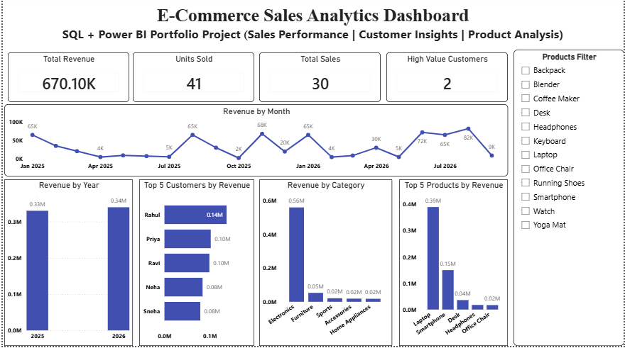

# E-Commerce Sales Analytics

A portfolio data analytics project analyzing e-commerce sales performance using **SQL Server** and **Power BI**.

## Project Overview

This project analyzes customer purchases, product performance, category performance, revenue trends, and customer behavior.

The project follows a practical analytics workflow:

**SQL data analysis → Business insights → Power BI dashboard**
## Power BI Dashboard



## Business Questions

The analysis answers questions such as:

- What is the total revenue and number of units sold?
- Which product categories generate the most revenue?
- Which customers generate the highest revenue?
- Which products are the top revenue generators?
- How does revenue change over time?
- Which customers are repeat buyers?
- Which customers are high-value customers?
- Which customers purchased in both 2025 and 2026?
- How does product performance differ by year?
- How do customers perform across product categories?

## Tools & Technologies

- **SQL Server** — data creation, querying, aggregation, joins, CTEs, subqueries, and window functions
- **Power BI** — dashboard development, DAX measures, interactive filtering, and data visualization
- **GitHub** — project documentation and version control

## Dataset

The project uses two simplified tables:

### `project_customers`

| Column | Description |
|---|---|
| `customer_id` | Unique customer ID |
| `customer_name` | Customer name |
| `city` | Customer city |
| `signup_date` | Customer signup date |

### `project_sales`

| Column | Description |
|---|---|
| `sale_id` | Unique sale ID |
| `customer_id` | Customer reference |
| `product` | Product purchased |
| `category` | Product category |
| `quantity` | Number of units sold |
| `price` | Unit price |
| `sale_date` | Sale date |

Revenue is calculated as:

```text
Revenue = price × quantity
```

## SQL Analysis

The SQL analysis includes 20 business-focused queries covering:

1. Overall sales performance
2. Category performance
3. Customer performance
4. Product performance
5. Monthly sales performance
6. Customer segmentation
7. Top 5 customers
8. Repeat customers
9. Revenue by year
10. Top 5 products by revenue
11. Revenue by category and year
12. Average sale value
13. Customers above average spending
14. Highest-spending customer
15. Customer ranking
16. 2026 monthly revenue
17. Customers purchasing in both years
18. Customer revenue by category
19. Revenue by customer and year
20. Product performance by year

SQL concepts demonstrated include:

- `SELECT` / `WHERE`
- Aggregations: `SUM`, `COUNT`, `AVG`, `MAX`
- `GROUP BY` / `HAVING`
- `ORDER BY`
- `JOIN`
- `CASE`
- CTEs
- Subqueries
- `DENSE_RANK()`
- Date functions such as `YEAR()` and `MONTH()`

## Power BI Dashboard

The Power BI dashboard provides an interactive view of the project's sales performance.

### Dashboard KPIs

- Total Revenue
- Total Units
- Total Sales
- High-Value Customers

### Dashboard Visuals

- Revenue by Month
- Revenue by Year
- Revenue by Category
- Top 5 Products by Revenue
- Top 5 Customers by Revenue
- Product filter for interactive analysis

### DAX Measures

Example:

```DAX
Total Revenue =
SUMX(
    project_sales,
    project_sales[price] * project_sales[quantity]
)
```

```DAX
Total Units =
SUM(project_sales[quantity])
```

```DAX
Total Sales =
COUNT(project_sales[sale_id])
```

## Project Structure

```text
Ecommerce-Sales-Analytics/
│
├── README.md
│
├── sql/
│   ├── 01_create_tables_and_data.sql
│   └── 02_ecommerce_sales_analysis.sql
│
├── powerbi/
│   └── Ecommerce_Sales_Analytics.pbix
│
└── screenshots/
    └── Ecommerce_Sales_Dashboard.png
```

## Skills Demonstrated

**SQL**
- Data aggregation
- Business analysis
- Joins
- CTEs
- Subqueries
- Window functions
- Date analysis
- Customer segmentation

**Power BI**
- Data modeling
- DAX measures
- KPI cards
- Interactive filters
- Time-series analysis
- Product/customer/category analysis
- Dashboard design

## Project Goal

The goal of this project is to demonstrate an end-to-end data analytics workflow, from SQL-based analysis to an interactive Power BI dashboard.
